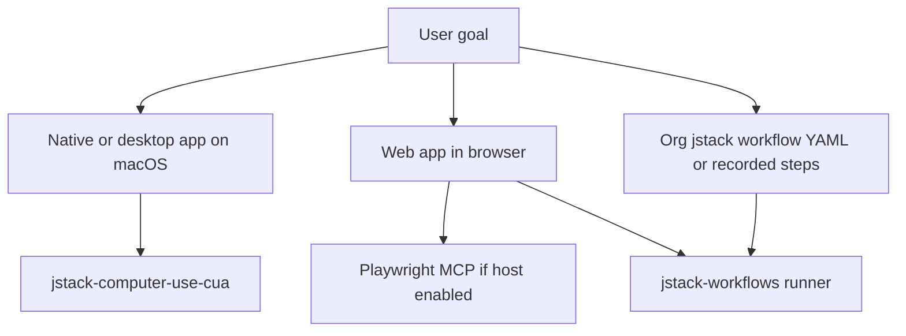

<!-- Chain Contract -->
<!-- inputs: user_request, jstack_config -->
<!-- outputs: structured_result -->

Read the setup preamble first:
!cat ${CLAUDE_PLUGIN_ROOT}/prompts/setup/preamble.md

## What this skill is for

**Orchestrator only** — pick the right automation surface. Do not duplicate workflow YAML orchestration (that is **`jstack-workflows`**). Do not invent a separate Chromium-API skill; web control goes through **Playwright MCP** (host) and/or **jstack workflow** runner.

## Decision flow

## Routing matrix

| Goal | Route | References |
|------|--------|------------|
| **Native macOS / Electron / desktop windows** (not a single browser tab) | **`jstack-computer-use-cua`** | `${CLAUDE_PLUGIN_ROOT}/skills/computer-use/cua/SKILL.md` |
| **Web app** in a browser; DOM, navigation, org QA in Chromium | **Playwright MCP** in the host (e.g. `@playwright/mcp`) + optional **`jstack-workflows`** | `${CLAUDE_PLUGIN_ROOT}/skills/_core/references/integration-guide.md` (MCP tools) |
| **Recorded / YAML workflow**, CI-parity browser flows, `jstack workflow` CLI | **`jstack-workflows`** (builder, runner, recorder, viewer, execute) | `${CLAUDE_PLUGIN_ROOT}/skills/workflows/SKILL.md` |
| **Playwright patterns** in prose (selectors, fixtures) | Link only | `${CLAUDE_PLUGIN_ROOT}/skills/workflows/references/playwright-patterns.md` |
| **browser_use** style agents / stubs | Link only | `${CLAUDE_PLUGIN_ROOT}/skills/workflows/references/browser-use-patterns.md` |

Full link table and upstream URLs: `${CLAUDE_PLUGIN_ROOT}/skills/computer-use/references/tool-matrix.md`.

## Cursor / IDE discovery

**Canonical bodies** live under **`jstack.core/skills/computer-use/`** in the plugin tree. If your team mirrors skills into **`.cursor/skills/`** for Cursor-only hosts, keep a **thin pointer** there (or a symlink policy) — do not maintain two full copies of the CUA body; link back to **`jstack-computer-use-cua`**.

Optional workspace-only helpers (e.g. **agent-browser**, **webapp-testing**) may complement web flows; **jstack product surface** for bundled automation remains **workflows + computer-use**.

## Config and references

- `jstack.config.json` — `mcp_servers`, integrations. Never hardcode.
- Questions: `${CLAUDE_PLUGIN_ROOT}/skills/_core/references/question-patterns.md`
- Discrete choices: `${CLAUDE_PLUGIN_ROOT}/skills/_core/references/ask-user-question-patterns.md`
- Integrations / MCP: `${CLAUDE_PLUGIN_ROOT}/skills/_core/references/integration-guide.md`
- Chaining: `${CLAUDE_PLUGIN_ROOT}/skills/_core/references/chaining-guide.md`

## Intake

1. Parse `$ARGUMENTS` — is the target **in-browser**, **desktop app**, or **declarative workflow file**?
2. If unclear, ask **one** question (e.g. "Is the UI inside a browser tab, or a native/desktop app?").
3. Emit **`suggested_next`** with the single best child skill and stop unless the user asked for a full chain.

## Output shape

- **Routing decision** — one paragraph: **surface** (desktop CUA vs web vs workflow YAML) + **rationale** tied to the matrix.
- **`suggested_next`** — single child skill name (e.g. `jstack-computer-use-cua`, `jstack-workflows`, or host Playwright MCP) — not a full runbook unless the user asked for execution.
- **No fabricated tool results** — if Playwright MCP or CUA is not available, state the gap and link **integration-guide**.

## Failure modes

| Symptom | Recovery |
|---------|----------|
| User needs web + desktop in one scenario | Split phases; web → workflows/MCP, desktop → **`jstack-computer-use-cua`**. |
| Playwright MCP not enabled | Point to host MCP config + integration guide; do not pretend tools exist. |
| User pastes workflow YAML | Route to **`jstack-workflows`** / runner or execute child. |

## User request

$ARGUMENTS
