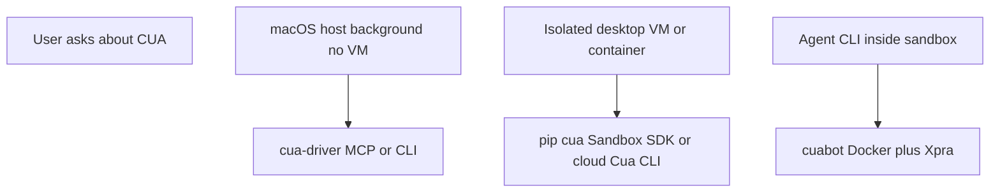

<!-- Chain Contract -->
<!-- inputs: user_request, jstack_config -->
<!-- outputs: structured_result -->

Read the setup preamble first:
!cat ${CLAUDE_PLUGIN_ROOT}/prompts/setup/preamble.md

## CUA (computer-use) — lifecycle and routing

**Child of `jstack-computer-use`.** Prefer **upstream docs** and **local `--help`** over guessing flags. See [upstream-links.md](${CLAUDE_PLUGIN_ROOT}/skills/computer-use/references/upstream-links.md).

If **native vs web** is unclear, route via **`jstack-computer-use`** first.

Upstream ships a bundled skill inside the app at `/Applications/CuaDriver.app/Contents/Resources/Skills/cua-driver/`. **This file** is the **jstack.core** canonical body under `skills/computer-use/cua/`. Register **Cua Driver** as **MCP** when the host supports it (`cua-driver mcp-config --client cursor` per upstream).

**Cursor / IDE:** optional thin copy under `.cursor/skills/` should **point here** — do not maintain two full bodies (see **`jstack-computer-use`** router).

## Config and references

- `jstack.config.json` — integrations, MCP. Never hardcode.
- Questions: `${CLAUDE_PLUGIN_ROOT}/skills/_core/references/question-patterns.md`
- Discrete choices: `${CLAUDE_PLUGIN_ROOT}/skills/_core/references/ask-user-question-patterns.md`
- Integrations / MCP: `${CLAUDE_PLUGIN_ROOT}/skills/_core/references/integration-guide.md`
- Chaining: `${CLAUDE_PLUGIN_ROOT}/skills/_core/references/chaining-guide.md`

## Choose your tool (first)

| Need | Default in jstack.core |
|------|------------------------|
| **Web** (URLs, DOM, headless Chromium, page assertions) | **`jstack-workflows`**, host **Playwright MCP**; optional workspace browse skills outside this plugin |
| **Native macOS / Electron / desktop windows** (not “one browser tab”) | **Cua Driver** — background UI automation (AX + screenshots + pixel paths) without stealing the user’s foreground Space |
| **Isolated VM/container** (malware, destructive installers, multi-tenant, non-host execution) | **Cua sandboxes** (Python SDK / cloud CLI) or **CuaBot** (Docker + Xpra + agent CLI inside) |

**macOS teams that are “browser-covered”** should still **lead with Cua Driver** for day-to-day app QA; treat cuabot and cloud sandboxes as **secondary** when isolation or non-host execution is required.

## Routing — which surface?



| Question | Route |
|----------|--------|
| Drive **this Mac’s** apps while Cursor stays frontmost? | **Cua Driver** |
| Run **Claude/Codex/etc.** inside Ubuntu with streamed GUI? | **CuaBot** |
| **Python** `Sandbox` / ephemeral VM, or **cloud** `cua sb`? | **Cua** (SDK + [Set up a sandbox](https://cua.ai/docs/cua/guide/get-started/set-up-sandbox)) |

## Debug sessions vs QA sessions (boundaries)

### Debug (IDE / lldb / breakpoints)

- **Cua Driver can**: launch the app under test, click/type, take window screenshots, read AX-backed state — useful for **scripted repro**, multi-step flows, and **UI state after** a breakpoint or timed steps.
- **Cua Driver cannot replace**: the **debugger** (lldb, Cursor debugger, attach PID). Use normal debug tooling for stacks, watches, stepping.
- **Pattern**: user runs the app from Xcode/CLI with debugger attached; agent uses Cua Driver to **exercise UI** and **verify** screenshots/AX; daemon stays up for element-indexed loops per upstream quickstart.
- **Trust**: follow **daemon-first TCC** + `check_permissions` (see [cua-driver-uninstall.md](${CLAUDE_PLUGIN_ROOT}/skills/computer-use/references/cua-driver-uninstall.md) and the installation page). IDE terminals can mis-report TCC; the daemon path attributes control to `CuaDriver.app`.

### QA (manual or agent-led)

- **Web QA**: **`jstack-workflows`** / Playwright MCP; use **`jstack-computer-use`** to route.
- **Desktop / native / Electron**: **Cua Driver** for window-scoped automation and screenshots; optionally combine in one session (web flows vs driver for Slack/Spotify/Calc/Electron shell).
- **Host must not be touched**: route to **CuaBot** or **Sandbox SDK / cloud** per routing table above.

## Verb matrices

Use the **summary tables** for a fast map. Each **verb** has an **expandable** block below (click the row title in Cursor / GitHub-style viewers) with **upstream refs** and **terminal copy-paste** examples.

### 1) Cua Driver (macOS 14+)

Docs: [Installation](https://cua.ai/docs/cua-driver/guide/getting-started/installation), [Quickstart](https://cua.ai/docs/cua-driver/guide/getting-started/quickstart).

| Verb | Actions |
|------|---------|
| **setup** | Install script from installation page (`curl` one-liner); ensure `~/.local/bin` on `PATH`; optional MCP: `cua-driver mcp-config --client cursor` → merge into Cursor `mcp.json`. |
| **test** | `cua-driver --version`, `cua-driver --help`; after daemon-first TCC: `cua-driver check_permissions`. |
| **execute** | Prefer MCP (`cua-driver mcp`) when registered. CLI: `launch_app`, `get_window_state`, `click`, etc. with JSON per quickstart. |
| **status** | `cua-driver status` (daemon socket / pid). |
| **restart** | `cua-driver stop` then `open -n -g -a CuaDriver --args serve` (TCC attributes to `CuaDriver.app`). |
| **destroy** | Uninstall steps: [cua-driver-uninstall.md](${CLAUDE_PLUGIN_ROOT}/skills/computer-use/references/cua-driver-uninstall.md) (verbatim from upstream). |

<details>
<summary><strong>setup</strong> — Cua Driver (install, PATH, MCP for Cursor)</summary>

**Refs:** [Installation](https://cua.ai/docs/cua-driver/guide/getting-started/installation) · [MCP config](https://cua.ai/docs/cua-driver/guide/getting-started/installation#register-with-an-mcp-client-optional)

Install drops `CuaDriver.app` in `/Applications` and symlinks `~/.local/bin/cua-driver`. Reload shell if the installer appended `PATH`.

```bash
# Official install (no sudo on typical Mac accounts)
/bin/bash -c "$(curl -fsSL https://raw.githubusercontent.com/trycua/cua/main/libs/cua-driver/scripts/install.sh)"
```

```bash
# Optional: custom bin dir or skip rc edits (see install doc for full flags)
# /bin/bash -c "$(curl -fsSL https://raw.githubusercontent.com/trycua/cua/main/libs/cua-driver/scripts/install.sh)" -- --no-modify-path
```

```bash
# Cursor MCP: print JSON snippet, then paste into ~/.cursor/mcp.json (or project .cursor/mcp.json)
cua-driver mcp-config --client cursor
# Or copy to clipboard on macOS:
# cua-driver mcp-config --client cursor | pbcopy
```

The spawned command shape is typically `~/.local/bin/cua-driver mcp` (stdio MCP). See installation page for Claude Code / Codex / other clients.

</details>

<details>
<summary><strong>test</strong> — Cua Driver (version, help, TCC)</summary>

**Refs:** [Installation — Verify](https://cua.ai/docs/cua-driver/guide/getting-started/installation#verify-it-worked) · [Grant TCC](https://cua.ai/docs/cua-driver/guide/getting-started/installation#grant-tcc-permissions)

```bash
cua-driver --version
cua-driver --help
```

```bash
# Daemon first so TCC attributes to CuaDriver.app, then trigger permission prompts
open -n -g -a CuaDriver --args serve
cua-driver check_permissions
# Grant in System Settings if needed, then re-run:
cua-driver check_permissions
```

IDE terminals may show misleading TCC status; prefer the daemon-first flow above.

</details>

<details>
<summary><strong>execute</strong> — Cua Driver (CLI loop; prefer MCP when registered)</summary>

**Refs:** [Quickstart](https://cua.ai/docs/cua-driver/guide/getting-started/quickstart) · [MCP tools](https://cua.ai/docs/cua-driver/reference/mcp-tools) · [CLI reference](https://cua.ai/docs/cua-driver/reference/cli-reference)

Element-indexed flows need a **running daemon** (cache is in-process). Optional: `cua-driver config set capture_mode som` for AX + screenshot in snapshots.

```bash
open -n -g -a CuaDriver --args serve
cua-driver status
```

```bash
# Launch app in background (example: Calculator)
cua-driver launch_app '{"bundle_id":"com.apple.calculator"}'
# Note returned pid and window_id from output, then:
cua-driver get_window_state '{"pid":844,"window_id":10725}'
```

```bash
# Click by element_index from the snapshot (replace pid, window_id, index)
cua-driver click '{"pid":844,"window_id":10725,"element_index":14}'
```

```bash
# Re-snapshot to verify the UI changed (required pattern per quickstart)
cua-driver get_window_state '{"pid":844,"window_id":10725}'
```

```bash
# Pixel click + screenshot file (window-local coordinates)
cua-driver get_window_state '{"pid":844,"window_id":10725}' --image-out /tmp/shot.png
cua-driver click '{"pid":844,"window_id":10725,"x":120,"y":240}'
```

```bash
# MCP stdio (registered in Cursor): the client runs this; do not paste unless debugging
# ~/.local/bin/cua-driver mcp
```

Replace `pid` / `window_id` / `element_index` with values from **your** `launch_app` / `get_window_state` output.

</details>

<details>
<summary><strong>status</strong> — Cua Driver</summary>

**Ref:** [Installation — Run the daemon](https://cua.ai/docs/cua-driver/guide/getting-started/installation#run-the-daemon)

```bash
cua-driver status
```

</details>

<details>
<summary><strong>restart</strong> — Cua Driver</summary>

**Ref:** [Installation — Run the daemon](https://cua.ai/docs/cua-driver/guide/getting-started/installation#run-the-daemon)

`open -n -g -a CuaDriver --args serve` ties the process to `CuaDriver.app` for TCC.

```bash
cua-driver stop
open -n -g -a CuaDriver --args serve
cua-driver status
```

</details>

<details>
<summary><strong>destroy</strong> — Cua Driver (uninstall)</summary>

**Ref:** [cua-driver-uninstall.md](${CLAUDE_PLUGIN_ROOT}/skills/computer-use/references/cua-driver-uninstall.md) (verbatim from installation page)

```bash
cua-driver stop 2>/dev/null
rm -rf /Applications/CuaDriver.app
rm -f ~/.local/bin/cua-driver
sudo rm -f /usr/local/bin/cua-driver 2>/dev/null || true
rm -rf ~/.cua-driver
rm -rf ~/Library/Application\ Support/Cua\ Driver
rm -rf ~/Library/Caches/cua-driver
launchctl unload ~/Library/LaunchAgents/com.trycua.cua_driver_updater.plist 2>/dev/null
rm -f ~/Library/LaunchAgents/com.trycua.cua_driver_updater.plist
```

Require explicit user confirmation before running uninstall on their machine.

</details>

### 2) CuaBot

Docs: [Introduction](https://docs.trycua.com/cuabot/guide/getting-started/introduction), [Installation](https://cua.ai/docs/cuabot/guide/getting-started/installation).

| Verb | Actions |
|------|---------|
| **setup** | `npx cuabot` onboarding or `npm install -g cuabot`; Docker + Xpra per installation doc; macOS **quarantine** on Xpra if noted there. |
| **test** | `cuabot --screenshot`; optional `cuabot chromium` for GUI path. |
| **execute** | `cuabot <agent>` (e.g. `claude`, `codex`), `cuabot bash`, `cuabot --bash`, `--type`, `--click`, etc.; named sessions `-n` / `--name`. |
| **status** | `cuabot --status`. |
| **restart** | `cuabot --stop` then `cuabot --serve [port]` or re-run `npx cuabot` as appropriate. |
| **destroy** | `cuabot --stop`; optional reset: remove `~/.cuabot` session/config files if user wants a clean slate; if Docker containers remain, user can inspect with `docker ps` and stop/remove — do not invent proprietary Docker flags. |

<details>
<summary><strong>setup</strong> — CuaBot</summary>

**Refs:** [Introduction — Quick Start](https://docs.trycua.com/cuabot/guide/getting-started/introduction#quick-start) · [Installation](https://cua.ai/docs/cuabot/guide/getting-started/installation)

```bash
# Onboarding (downloads / configures per docs)
npx cuabot
```

```bash
# Global install (alternative)
npm install -g cuabot
```

Follow the installation doc for Docker, Xpra, and any macOS quarantine steps for Xpra.

</details>

<details>
<summary><strong>test</strong> — CuaBot</summary>

**Ref:** [Introduction — Commands](https://docs.trycua.com/cuabot/guide/getting-started/introduction#commands)

```bash
cuabot --screenshot
```

```bash
cuabot chromium
```

</details>

<details>
<summary><strong>execute</strong> — CuaBot</summary>

**Ref:** [Introduction](https://docs.trycua.com/cuabot/guide/getting-started/introduction)

```bash
cuabot claude
cuabot codex
cuabot bash
```

```bash
# Named session (separate container / port / window chrome)
cuabot -n work claude
cuabot --name dev bash
```

```bash
# Input automation (coordinates and keys per introduction)
cuabot --bash "echo hello"
cuabot --type "hello"
cuabot --click 100 200
cuabot --help
```

</details>

<details>
<summary><strong>status</strong> — CuaBot</summary>

**Ref:** [Introduction — Commands](https://docs.trycua.com/cuabot/guide/getting-started/introduction#commands)

```bash
cuabot --status
```

</details>

<details>
<summary><strong>restart</strong> — CuaBot</summary>

**Ref:** [Introduction — Commands](https://docs.trycua.com/cuabot/guide/getting-started/introduction#commands)

```bash
cuabot --stop
cuabot --serve
# Optional explicit port:
# cuabot --serve 8765
```

```bash
# Or re-enter via npx after stop
npx cuabot
```

</details>

<details>
<summary><strong>destroy</strong> — CuaBot</summary>

**Ref:** [Introduction — Configuration](https://docs.trycua.com/cuabot/guide/getting-started/introduction#configuration)

```bash
cuabot --stop
```

```bash
# Optional: reset local config / session files (user must agree)
rm -rf ~/.cuabot
```

```bash
# If Docker containers remain, inspect and stop manually (no invented flags)
docker ps
# docker stop <container>
```

</details>

### 3) Cua sandboxes (SDK / cloud / local images)

Docs: [Set up a sandbox](https://cua.ai/docs/cua/guide/get-started/set-up-sandbox), [Computer SDK](https://cua.ai/docs/cua/guide/get-started/using-computer-sdk), [README](https://github.com/trycua/cua).

| Verb | Actions |
|------|---------|
| **setup** | Python: `pip install cua` (3.11+). Cloud CLI (from sandbox doc): `curl -LsSf https://cua.ai/cli/install.sh \| sh`, then `cua auth login`. Example create from same doc: `cua sb create --os linux --size small --region north-america`. Local Docker / **Lume** on macOS: follow sandbox doc sections (link out; do not duplicate proprietary Lume invocations here). |
| **test** | Minimal SDK smoke: ephemeral `Sandbox`, `shell.run("echo hello")`, `screenshot` per monorepo README patterns; cloud: confirm sandbox reachable per doc next steps. |
| **execute** | Python SDK mouse/keyboard/mobile per README and Computer SDK doc. |
| **status** | SDK: connection health from client; cloud: dashboard/API after `cua auth login`. |
| **restart** | Recreate sandbox or reconnect client (ephemeral pattern). |
| **destroy** | Python: exit `async with Sandbox.ephemeral(...)`. **Cloud CLI teardown**: the public “Set up a sandbox” page documents **create** (`cua sb create …`); **list/delete/teardown subcommands are not quoted here**. After installing the CLI, run `cua --help` and `cua sb --help` (or use the cloud dashboard) and document only **verified** commands in session notes — do not invent `sb delete` syntax. |

<details>
<summary><strong>setup</strong> — Cua sandboxes (Python SDK + cloud CLI)</summary>

**Refs:** [Set up a sandbox](https://cua.ai/docs/cua/guide/get-started/set-up-sandbox) · [trycua/cua README](https://github.com/trycua/cua)

```bash
# Python SDK (3.11+)
pip install cua
```

```bash
# Cloud CLI installer (from sandbox doc)
curl -LsSf https://cua.ai/cli/install.sh | sh
cua auth login
```

```bash
# Example create (from sandbox doc — adjust flags per current docs)
cua sb create --os linux --size small --region north-america
```

Local Docker images, Lume, and Windows Sandbox paths: follow the same sandbox guide; do not guess image names or Lume CLI beyond upstream.

</details>

<details>
<summary><strong>test</strong> — Cua sandboxes (minimal SDK smoke)</summary>

**Refs:** [README — Cua sandboxes](https://github.com/trycua/cua) · [Computer SDK](https://cua.ai/docs/cua/guide/get-started/using-computer-sdk)

```python
# Requires Python 3.11+
import asyncio
from cua import Sandbox, Image

async def main() -> None:
    async with Sandbox.ephemeral(Image.linux()) as sb:
        result = await sb.shell.run("echo hello")
        _ = result
        screenshot = await sb.screenshot()
        _ = screenshot

asyncio.run(main())
```

Cloud: after `cua sb create`, use the dashboard / doc “next steps” to confirm the instance is reachable.

</details>

<details>
<summary><strong>execute</strong> — Cua sandboxes (SDK actions)</summary>

**Ref:** [README — Cua sandboxes](https://github.com/trycua/cua)

```python
# Inside async with Sandbox.ephemeral(...) as sb:
await sb.mouse.click(100, 200)
await sb.keyboard.type("Hello from Cua!")
await sb.mobile.gesture((100, 500), (100, 200))
```

Full connection patterns and limits: [Computer SDK](https://cua.ai/docs/cua/guide/get-started/using-computer-sdk).

</details>

<details>
<summary><strong>status</strong> — Cua sandboxes</summary>

**Refs:** [Set up a sandbox](https://cua.ai/docs/cua/guide/get-started/set-up-sandbox)

- **SDK:** use client connection errors / logs from your `Sandbox` session.
- **Cloud:** browser dashboard and API after `cua auth login` (see doc).

```bash
# After CLI install — discover current subcommands (do not assume output)
cua --help
cua sb --help
```

</details>

<details>
<summary><strong>restart</strong> — Cua sandboxes</summary>

**Ref:** [Set up a sandbox](https://cua.ai/docs/cua/guide/get-started/set-up-sandbox)

Typical pattern: tear down the old sandbox (CLI/dashboard/SDK) and create a new one, or reconnect the SDK client per Computer SDK doc. No universal one-liner without verifying your provider’s CLI.

</details>

<details>
<summary><strong>destroy</strong> — Cua sandboxes</summary>

**Refs:** [README](https://github.com/trycua/cua) · [Set up a sandbox](https://cua.ai/docs/cua/guide/get-started/set-up-sandbox)

```python
# Ephemeral SDK: exiting the context manager ends the sandbox session
async with Sandbox.ephemeral(Image.linux()) as sb:
    await sb.shell.run("echo bye")
# ... context exit = teardown for ephemeral pattern
```

**Cloud / local CLI:** the public sandbox guide documents **`cua sb create`**. For **delete / stop / list**, run `cua sb --help` after install (or use the cloud dashboard) and copy only **verified** commands into runbooks — do not invent `sb delete` syntax here.

</details>

## Safety and permissions

- **Computer-use** drives real or virtual desktops. Require **explicit user intent** before uninstall, `docker rm`, deleting cloud sandboxes, or destructive installers.
- **macOS TCC**: Screen Recording and Accessibility must be granted to **Cua Driver**; use **daemon-first** `open -n -g -a CuaDriver --args serve` then `cua-driver check_permissions`. See [cua-driver-uninstall.md](${CLAUDE_PLUGIN_ROOT}/skills/computer-use/references/cua-driver-uninstall.md).
- **Install lines** stay upstream (`bash`, `npm`, `pip`); this repo does not require wrapping in Bun unless a future thin script is added.

## When to read which reference

| File | Use |
|------|-----|
| [upstream-links.md](${CLAUDE_PLUGIN_ROOT}/skills/computer-use/references/upstream-links.md) | Canonical URLs for Driver, CuaBot, sandboxes, GitHub |
| [cua-driver-uninstall.md](${CLAUDE_PLUGIN_ROOT}/skills/computer-use/references/cua-driver-uninstall.md) | Verbatim uninstall + TCC troubleshooting summary |
