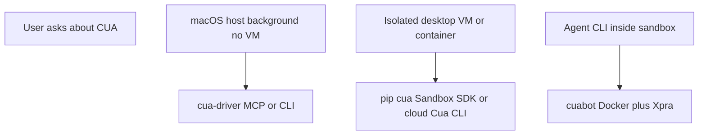

<!-- Chain Contract -->
<!-- inputs: user_request, jstack_config -->
<!-- outputs: structured_result -->

Read the setup preamble first:
!cat ${CLAUDE_PLUGIN_ROOT}/prompts/setup/preamble.md

## CUA (computer-use) — lifecycle and routing

**Child of `jstack-computer-use`.** Prefer **upstream docs** and **local `--help`** over guessing flags. See [upstream-links.md](${CLAUDE_PLUGIN_ROOT}/skills/computer-use/references/upstream-links.md).

If **native vs web** is unclear, route via **`jstack-computer-use`** first.

- **Out of scope:** Acting as a debugger for stack/variable inspection (lldb, IDE debugger own that — Cua Driver only drives and observes UI); running destroy/teardown verbs (uninstall, `docker rm`, cloud sandbox delete) without explicit user confirmation; guessing an unverified CLI subcommand the upstream docs haven't confirmed.

Upstream ships a bundled skill inside the app at `/Applications/CuaDriver.app/Contents/Resources/Skills/cua-driver/`. **This file** is the **jstack.core** canonical body under `skills/computer-use/cua/`. Register **Cua Driver** as **MCP** when the host supports it (`cua-driver mcp-config --client cursor` per upstream).

**Cursor / IDE:** optional thin copy under `.cursor/skills/` should **point here** — do not maintain two full bodies (see **`jstack-computer-use`** router).

## Config and references

- `jstack.config.json` — integrations, MCP. Never hardcode.
- Questions: `${CLAUDE_PLUGIN_ROOT}/skills/_core/references/question-patterns.md`
- Discrete choices: `${CLAUDE_PLUGIN_ROOT}/skills/_core/references/ask-user-question-patterns.md`
- Integrations / MCP: `${CLAUDE_PLUGIN_ROOT}/skills/_core/references/integration-guide.md`
- Chaining: `${CLAUDE_PLUGIN_ROOT}/skills/_core/references/chaining-guide.md`

## Choose your tool (first)

| Need | Default in jstack.core |
|------|------------------------|
| **Web** (URLs, DOM, headless Chromium, page assertions) | **`jstack-workflows`**, host **Playwright MCP**; optional workspace browse skills outside this plugin |
| **Native macOS / Electron / desktop windows** (not “one browser tab”) | **Cua Driver** — background UI automation (AX + screenshots + pixel paths) without stealing the user’s foreground Space |
| **Isolated VM/container** (malware, destructive installers, multi-tenant, non-host execution) | **Cua sandboxes** (Python SDK / cloud CLI) or **CuaBot** (Docker + Xpra + agent CLI inside) |

**macOS teams that are “browser-covered”** should still **lead with Cua Driver** for day-to-day app QA; treat cuabot and cloud sandboxes as **secondary** when isolation or non-host execution is required.

## Routing — which surface?

```mermaid
flowchart TD
  userQ[User asks about CUA]
  macBG[macOS host background no VM]
  isolated[Isolated desktop VM or container]
  agentShell[Agent CLI inside sandbox]
  macBG --> driver[cua-driver MCP or CLI]
  isolated --> sdk[pip cua Sandbox SDK or cloud Cua CLI]
  agentShell --> cuabot[cuabot Docker plus Xpra]
```

| Question | Route |
|----------|--------|
| Drive **this Mac’s** apps while Cursor stays frontmost? | **Cua Driver** |
| Run **Claude/Codex/etc.** inside Ubuntu with streamed GUI? | **CuaBot** |
| **Python** `Sandbox` / ephemeral VM, or **cloud** `cua sb`? | **Cua** (SDK + [Set up a sandbox](https://cua.ai/docs/cua/guide/get-started/set-up-sandbox)) |

## Debug sessions vs QA sessions (boundaries)

### Debug (IDE / lldb / breakpoints)

- **Cua Driver can**: launch the app under test, click/type, take window screenshots, read AX-backed state — useful for **scripted repro**, multi-step flows, and **UI state after** a breakpoint or timed steps.
- **Cua Driver cannot replace**: the **debugger** (lldb, Cursor debugger, attach PID). Use normal debug tooling for stacks, watches, stepping.
- **Pattern**: user runs the app from Xcode/CLI with debugger attached; agent uses Cua Driver to **exercise UI** and **verify** screenshots/AX; daemon stays up for element-indexed loops per upstream quickstart.
- **Trust**: follow **daemon-first TCC** + `check_permissions` (see [cua-driver-uninstall.md](${CLAUDE_PLUGIN_ROOT}/skills/computer-use/references/cua-driver-uninstall.md) and the installation page). IDE terminals can mis-report TCC; the daemon path attributes control to `CuaDriver.app`.

### QA (manual or agent-led)

- **Web QA**: **`jstack-workflows`** / Playwright MCP; use **`jstack-computer-use`** to route.
- **Desktop / native / Electron**: **Cua Driver** for window-scoped automation and screenshots; optionally combine in one session (web flows vs driver for Slack/Spotify/Calc/Electron shell).
- **Host must not be touched**: route to **CuaBot** or **Sandbox SDK / cloud** per routing table above.

## Verb matrices

Use the **summary tables** for a fast map. Terminal copy-paste examples per verb live in a
reference file per surface (moved out of this file to stay under the 500-line skill budget):
[cua-driver-verbs.md](${CLAUDE_PLUGIN_ROOT}/skills/computer-use/references/cua-driver-verbs.md),
[cuabot-verbs.md](${CLAUDE_PLUGIN_ROOT}/skills/computer-use/references/cuabot-verbs.md),
[cua-sandboxes-verbs.md](${CLAUDE_PLUGIN_ROOT}/skills/computer-use/references/cua-sandboxes-verbs.md).

### 1) Cua Driver (macOS 14+)

Docs: [Installation](https://cua.ai/docs/cua-driver/guide/getting-started/installation), [Quickstart](https://cua.ai/docs/cua-driver/guide/getting-started/quickstart).

| Verb | Actions |
|------|---------|
| **setup** | Install script from installation page (`curl` one-liner); ensure `~/.local/bin` on `PATH`; optional MCP: `cua-driver mcp-config --client cursor` → merge into Cursor `mcp.json`. |
| **test** | `cua-driver --version`, `cua-driver --help`; after daemon-first TCC: `cua-driver check_permissions`. |
| **execute** | Prefer MCP (`cua-driver mcp`) when registered. CLI: `launch_app`, `get_window_state`, `click`, etc. with JSON per quickstart. |
| **status** | `cua-driver status` (daemon socket / pid). |
| **restart** | `cua-driver stop` then `open -n -g -a CuaDriver --args serve` (TCC attributes to `CuaDriver.app`). |
| **destroy** | Uninstall steps: [cua-driver-uninstall.md](${CLAUDE_PLUGIN_ROOT}/skills/computer-use/references/cua-driver-uninstall.md) (verbatim from upstream). |

Full per-verb examples: [cua-driver-verbs.md](${CLAUDE_PLUGIN_ROOT}/skills/computer-use/references/cua-driver-verbs.md).

### 2) CuaBot

Docs: [Introduction](https://docs.trycua.com/cuabot/guide/getting-started/introduction), [Installation](https://cua.ai/docs/cuabot/guide/getting-started/installation).

| Verb | Actions |
|------|---------|
| **setup** | `npx cuabot` onboarding or `npm install -g cuabot`; Docker + Xpra per installation doc; macOS **quarantine** on Xpra if noted there. |
| **test** | `cuabot --screenshot`; optional `cuabot chromium` for GUI path. |
| **execute** | `cuabot <agent>` (e.g. `claude`, `codex`), `cuabot bash`, `cuabot --bash`, `--type`, `--click`, etc.; named sessions `-n` / `--name`. |
| **status** | `cuabot --status`. |
| **restart** | `cuabot --stop` then `cuabot --serve [port]` or re-run `npx cuabot` as appropriate. |
| **destroy** | `cuabot --stop`; optional reset: remove `~/.cuabot` session/config files if user wants a clean slate; if Docker containers remain, user can inspect with `docker ps` and stop/remove — do not invent proprietary Docker flags. |

Full per-verb examples: [cuabot-verbs.md](${CLAUDE_PLUGIN_ROOT}/skills/computer-use/references/cuabot-verbs.md).

### 3) Cua sandboxes (SDK / cloud / local images)

Docs: [Set up a sandbox](https://cua.ai/docs/cua/guide/get-started/set-up-sandbox), [Computer SDK](https://cua.ai/docs/cua/guide/get-started/using-computer-sdk), [README](https://github.com/trycua/cua).

| Verb | Actions |
|------|---------|
| **setup** | Python: `pip install cua` (3.11+). Cloud CLI (from sandbox doc): `curl -LsSf https://cua.ai/cli/install.sh \| sh`, then `cua auth login`. Example create from same doc: `cua sb create --os linux --size small --region north-america`. Local Docker / **Lume** on macOS: follow sandbox doc sections (link out; do not duplicate proprietary Lume invocations here). |
| **test** | Minimal SDK smoke: ephemeral `Sandbox`, `shell.run("echo hello")`, `screenshot` per monorepo README patterns; cloud: confirm sandbox reachable per doc next steps. |
| **execute** | Python SDK mouse/keyboard/mobile per README and Computer SDK doc. |
| **status** | SDK: connection health from client; cloud: dashboard/API after `cua auth login`. |
| **restart** | Recreate sandbox or reconnect client (ephemeral pattern). |
| **destroy** | Python: exit `async with Sandbox.ephemeral(...)`. **Cloud CLI teardown**: the public “Set up a sandbox” page documents **create** (`cua sb create …`); **list/delete/teardown subcommands are not quoted here**. After installing the CLI, run `cua --help` and `cua sb --help` (or use the cloud dashboard) and document only **verified** commands in session notes — do not invent `sb delete` syntax. |

Full per-verb examples: [cua-sandboxes-verbs.md](${CLAUDE_PLUGIN_ROOT}/skills/computer-use/references/cua-sandboxes-verbs.md).

## Safety and permissions

- **Computer-use** drives real or virtual desktops. Require **explicit user intent** before uninstall, `docker rm`, deleting cloud sandboxes, or destructive installers.
- **macOS TCC**: Screen Recording and Accessibility must be granted to **Cua Driver**; use **daemon-first** `open -n -g -a CuaDriver --args serve` then `cua-driver check_permissions`. See [cua-driver-uninstall.md](${CLAUDE_PLUGIN_ROOT}/skills/computer-use/references/cua-driver-uninstall.md).
- **Install lines** stay upstream (`bash`, `npm`, `pip`); this repo does not require wrapping in Bun unless a future thin script is added.

## Domain rules — cua

### Absolute rules

1. **Daemon-first, always.** Trigger TCC and permission checks via `open -n -g -a CuaDriver --args serve` before `check_permissions` or any driver command — an IDE terminal can mis-report Screen Recording/Accessibility status because the grant attributes to the terminal, not to `CuaDriver.app`.
2. **Re-verify UI state after every action, before issuing the next one.** An `element_index` or pixel coordinate is only valid for the snapshot it came from; a `click` followed immediately by another `click` with no `get_window_state` in between is driving blind.
3. **Cua Driver observes and drives UI — it does not replace a debugger.** It has no stacks, watches, or step execution; use it to exercise UI and verify screenshots/AX state while a real debugger (lldb, IDE debugger) holds the breakpoint.
4. **Never invent a CLI subcommand the docs haven't confirmed.** Where the public docs only document `create` (e.g. `cua sb create`) and not `delete`/`list`, run `--help` and copy only verified output into runbooks.
5. **Destructive actions require explicit user confirmation.** Uninstall, `docker rm`, and cloud sandbox teardown act on a real or virtual desktop with no undo — never run them because a step "seems next."

### Named anti-patterns

| Anti-pattern | Why it's wrong | What to do instead |
|---|---|---|
| Blind pixel-clicking without re-snapshotting | UI state may have changed since the last snapshot; a stale coordinate clicks the wrong element | Element-indexed click, then `get_window_state` again to confirm before the next action |
| Treating IDE-terminal permission status as ground truth | IDE terminals can mis-report TCC because the grant attributes to the terminal process | Daemon-first: `open -n -g -a CuaDriver --args serve` then `cua-driver check_permissions` |
| Guessing an unverified CLI subcommand (e.g. `cua sb delete`) | Ships instructions the docs never confirmed; the command may not exist or may take different flags | Run `cua --help` / `cua sb --help` and document only verified output |
| Using Cua Driver in place of a real debugger | A UI screenshot doesn't explain a null pointer three frames down the call stack | Keep the debugger attached; use Cua Driver only to drive/observe UI state |
| Running a destroy verb (uninstall, `docker rm`, cloud sandbox delete) without explicit confirmation | No undo on a real or virtual desktop | Require explicit user confirmation before any destroy verb |

### Worked example

- *Weak:* Two `cua-driver click` calls back to back on the assumption the UI hasn't changed between them.
- *Sharp:* `cua-driver get_window_state '{"pid":844,"window_id":10725}'` → read the returned `element_index` for the target control → `cua-driver click '{"pid":844,"window_id":10725,"element_index":14}'` → `cua-driver get_window_state '{"pid":844,"window_id":10725}'` again to confirm the click landed before issuing the next action.

### What this skill must not do

- Not a substitute for lldb / IDE debugger stack inspection — Cua Driver drives and observes UI only (Absolute rule 3).
- Does not run destructive teardown without explicit user confirmation, regardless of how routine the cleanup seems.

## When to read which reference

| File | Use |
|------|-----|
| [upstream-links.md](${CLAUDE_PLUGIN_ROOT}/skills/computer-use/references/upstream-links.md) | Canonical URLs for Driver, CuaBot, sandboxes, GitHub |
| [cua-driver-uninstall.md](${CLAUDE_PLUGIN_ROOT}/skills/computer-use/references/cua-driver-uninstall.md) | Verbatim uninstall + TCC troubleshooting summary |
| [cua-driver-verbs.md](${CLAUDE_PLUGIN_ROOT}/skills/computer-use/references/cua-driver-verbs.md) | Cua Driver per-verb terminal examples |
| [cuabot-verbs.md](${CLAUDE_PLUGIN_ROOT}/skills/computer-use/references/cuabot-verbs.md) | CuaBot per-verb terminal examples |
| [cua-sandboxes-verbs.md](${CLAUDE_PLUGIN_ROOT}/skills/computer-use/references/cua-sandboxes-verbs.md) | Cua sandboxes per-verb SDK/CLI examples |
