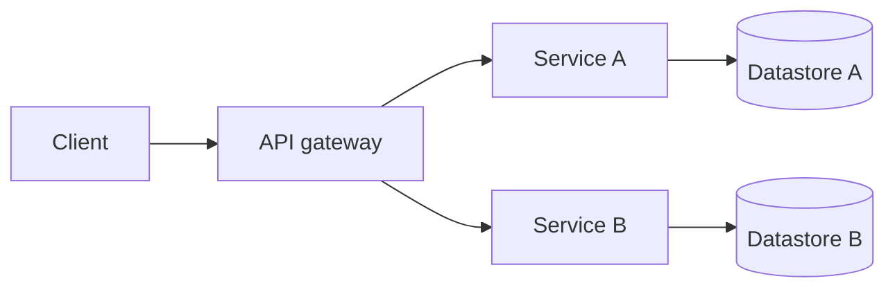

# 🛠️ Engineering — {{team_name}} {color="blue"}

<callout icon="🛠️" color="blue_bg">
	**Engineering hub.** Health signals, owned services, repos, runbooks, on-call rotation. Pulls from CI / Jira / GitHub via configured integrations.
</callout>

<table_of_contents color="gray"/>

<columns>
	<column>
		### 🟢 Health {color="green"}
		- **CI:** _status_
		- **Deploy:** _last green_
		- **Open PRs:** _count_
		- **PRs >24h in review:** _count_
	</column>
	<column>
		### 🚨 On-call now {color="red"}
		<mention-page url="">On-call</mention-page>
		_Current rotation owner._
	</column>
	<column>
		### 📊 Velocity {color="purple"}
		- **Sprint #:** _N_
		- **Throughput:** _PRs/wk_
		- **Cycle time p50:** _Xh_
	</column>
</columns>

## Owned services

<table fit-page-width="true" header-row="true">
	<tr color="blue_bg">
		<td>Service</td><td>Repo</td><td>Tier</td><td>Owner</td><td>Runbook</td>
	</tr>
	<tr>
		<td>**_service-a_**</td><td>github.com/{{org}}/_service-a_</td><td>Tier 1</td><td>{{primary_member_name}}</td><td>_runbook link_</td>
	</tr>
	<tr>
		<td>**_service-b_**</td><td>github.com/{{org}}/_service-b_</td><td>Tier 2</td><td>—</td><td>_runbook link_</td>
	</tr>
</table>

## Architecture

<callout icon="🏗️" color="blue_bg">
	**The wiki holds the readable narrative.** This dashboard is the operational view — health, ownership, on-call. For "how things work", see <mention-page url="">Wiki</mention-page>.
</callout>

_Replace with your real service map. Use ` ` for line breaks inside node labels, double-quote labels with parentheses._

## Code conventions

<columns>
	<column>
		### 📝 Style {color="blue"}
		- Linter: _name_
		- Formatter: _name_
		- Test runner: _name_
		- Coverage target: _%_
	</column>
	<column>
		### 🧪 Quality gates {color="green"}
		- All tests pass before merge
		- ≥1 reviewer approval
		- No unresolved review threads
		- Migrations reviewed by area owner
	</column>
	<column>
		### 🚀 Release {color="purple"}
		- Branch model: _trunk / release_
		- Cadence: _continuous / weekly_
		- Rollback runbook: _link_
	</column>
</columns>

## Active work

<mention-database url="">Tasks</mention-database>

## Documents

<callout icon="📁" color="brown_bg">
	**Engineering-tagged docs.** Filter <mention-database url="">Documents</mention-database> by `Tags includes eng`.
</callout>

## Runbooks

- _Common incident — link to runbook_
- _Deploy procedure — link_
- _Rollback procedure — link_
- _Database migration checklist — link_
- _Secrets rotation — link_

Promote new runbooks via `/jstack:notion knowledge-base`.

## Skills that write here

- `/jstack:engineering` — health summary
- `/jstack:review` — PR review
- `/jstack:incident` — incident commander
- `gusto-eng-throughput` (overlay)

---

_Wired by `jstack-notion-setup` — `notion_defaults.parent_pages.engineering_dashboard` (catalog: `engineering_dashboard`)_
