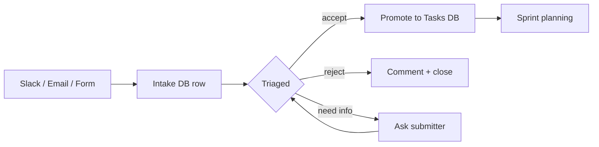

# 📥 Intake — {{team_name}} {color="red"}

<callout icon="📥" color="red_bg">
	**Triage hub.** Incoming feature requests, bugs, questions, and ideas land in the Intake DB. Triaged items get promoted to Tasks. Severity drives turnaround.
</callout>

<table_of_contents color="gray"/>

<columns>
	<column>
		### 🚨 Sev1 / Sev2 {color="red"}
		_Embed Intake view filtered to `Severity in (Sev1, Sev2)` AND `Status != Done`._
	</column>
	<column>
		### 🆕 Untriaged {color="orange"}
		_Embed Intake view filtered to `Status = Not started`._
	</column>
	<column>
		### ✅ Recently triaged {color="green"}
		_Embed view filtered to `Triaged At >= 7 days ago`._
	</column>
</columns>

## Intake DB

<mention-database url="">Intake</mention-database>

## Triage SLA

<callout icon="⏱️" color="yellow_bg">
	**Response targets** (acknowledge by, decision by). Decision = triaged + assigned or rejected with reason.
</callout>

<table fit-page-width="true" header-row="true">
	<tr color="red_bg">
		<td>Severity</td><td>Acknowledge</td><td>Decision</td><td>Implication</td>
	</tr>
	<tr color="red_bg">
		<td>**Sev1**</td><td>1 hour</td><td>4 hours</td><td>blocker / outage / data loss</td>
	</tr>
	<tr color="orange_bg">
		<td>**Sev2**</td><td>1 business day</td><td>3 business days</td><td>significant impact, no workaround</td>
	</tr>
	<tr color="yellow_bg">
		<td>**Sev3**</td><td>3 business days</td><td>1 week</td><td>impactful, workaround exists</td>
	</tr>
	<tr color="gray_bg">
		<td>**Sev4**</td><td>1 week</td><td>backlog</td><td>cosmetic / nice-to-have</td>
	</tr>
</table>

## Routing

## Submitter contract

<callout icon="🤝" color="blue_bg">
	**Submitters get:** acknowledgment within SLA, a clear decision, and a link to the resulting Task / ADR / explanation. **Submitters give:** title, type, severity guess, repro steps (if bug), and source.
</callout>

## Source channels

- **Slack:** `#{{team_intake_channel}}` ← configure in `channels.intake`
- **Email:** `{{intake_email}}` ← configure in `integrations.share_html`
- **Form:** Notion form for the Intake DB
- **Meeting:** captured live by note-taker

## Skills that write here

- `/jstack:intake` — convert unstructured asks into Intake DB rows
- `/jstack:task-intake` — full intake → triage → ticket pipeline
- `atlassian:triage-issue` — Jira-side triage with dup-check

---

_Wired by `jstack-notion-setup` — `notion_defaults.parent_pages.intake_dashboard` (catalog: `intake_dashboard`)_
