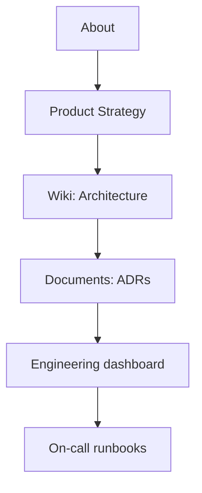

# 🚀 Onboarding — {{team_name}} {color="green"}

<callout icon="🚀" color="green_bg">
	**Welcome to {{team_name}}.** This is your first-week-and-beyond checklist. Pair with your buddy and your manager. Estimated to first PR: ~5–10 days; to autonomous on a service: ~30 days.
</callout>

<table_of_contents color="gray"/>

## Day 1

<columns>
	<column>
		### ✅ Access {color="green"}
		- [ ] GitHub org invite accepted
		- [ ] Slack channels joined
		- [ ] Notion teamspace access
		- [ ] Jira project added
		- [ ] Cloud / VPN credentials
		- [ ] Calendar invites for recurring meetings
	</column>
	<column>
		### 👋 Intros {color="blue"}
		- [ ] 1:1 with manager scheduled
		- [ ] Buddy assigned
		- [ ] Met direct teammates
		- [ ] Joined `#{{team_slack_channel}}`
	</column>
</columns>

## Week 1

- [ ] Read <mention-page url="">About</mention-page>
- [ ] Read <mention-page url="">Product Strategy</mention-page>
- [ ] Skim <mention-page url="">Wiki</mention-page>
- [ ] Browse <mention-database url="">Documents</mention-database> (start with `Type = ADR`)
- [ ] Set up local dev environment (see <mention-page url="">Engineering</mention-page>)
- [ ] Pair on a small task / pick up a `good-first-issue`
- [ ] Attend standup, retro, and planning

## Week 2

- [ ] Ship first PR (paired or solo, owner reviews)
- [ ] Read recent ADRs and ask "why?" about anything unclear
- [ ] Shadow on-call (do not act, just observe)
- [ ] First retro contribution (one keep / stop / try)

## First 30 days

- [ ] Own a sprint task end-to-end
- [ ] Lead a discussion (standup, retro, or design review)
- [ ] Write your first internal doc (Notes → Documents promotion)
- [ ] Attend on-call training, schedule first solo on-call shift

## First 60–90 days

<columns>
	<column>
		### 🎯 Outcomes {color="green"}
		- Owning a service or feature area
		- Driving discussions in your area
		- Onboarding the next person
	</column>
	<column>
		### 📈 Growth signals {color="blue"}
		- PR throughput steady
		- Confident on-call
		- Asking second-order questions
	</column>
</columns>

## Key reading order

## Who to ask what

| Question | Ask |
|---|---|
| Codebase / architecture | Buddy or area owner |
| Process / cadence | Manager |
| Product / roadmap | PM / EM |
| Security / compliance | Security team channel |
| Random unblocker | `#{{team_slack_channel}}` |

## Buddy expectations

<callout icon="🤝" color="blue_bg">
	**Buddies meet daily for the first week, then 2x/week for weeks 2–4, then ad-hoc.** Buddy's job is "remove friction" — codebase walkthroughs, intros, "is this normal?" sanity checks.
</callout>

## Skills that write here

- `/jstack:knowledge intake` (capture observations)
- `/jstack:notion knowledge-base` (promote learnings to Wiki)

---

_Wired by `jstack-notion-setup` — `notion_defaults.parent_pages.onboarding_dashboard` (catalog: `onboarding_dashboard`)_
