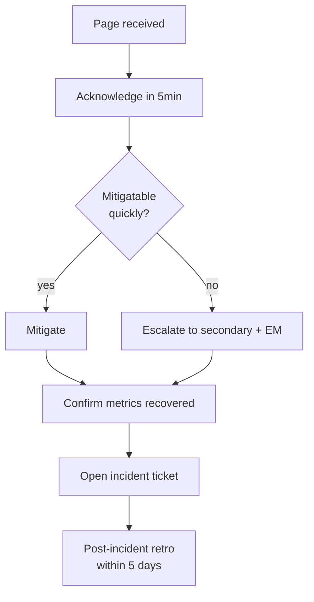

# 🚨 On-call — {{team_name}} {color="red"}

<callout icon="🚨" color="red_bg">
	**On-call hub.** Current rotation, escalation paths, runbooks, recent incidents. Page-able alerts go through PagerDuty / Opsgenie — this dashboard is the operational reference, not the alert source.
</callout>

<table_of_contents color="gray"/>

<columns>
	<column>
		### 🟢 Primary {color="red"}
		**_Current owner_**
		_Rotation ends: YYYY-MM-DD_
	</column>
	<column>
		### 🟡 Secondary {color="orange"}
		**_Backup_**
		_Steps in if primary unreachable >15min._
	</column>
	<column>
		### 🆘 Escalation {color="purple"}
		**_Manager / EM_**
		**_Director_**
		_Org-level escalation runbook._
	</column>
</columns>

## Schedule

<callout icon="📅" color="red_bg">
	**Rotation source of truth lives in PagerDuty / Opsgenie.** Mirror the upcoming 4 weeks here for quick scan; never manually edit ahead of the system of record.
</callout>

| Week | Primary | Secondary | Notes |
|---|---|---|---|
| _W1_ | _name_ | _name_ | _none_ |
| _W2_ | _name_ | _name_ | holiday coverage |
| _W3_ | _name_ | _name_ | — |
| _W4_ | _name_ | _name_ | — |

## Severity playbook

<table fit-page-width="true" header-row="true">
	<tr color="red_bg">
		<td>Severity</td><td>What it means</td><td>Page</td><td>Comms</td>
	</tr>
	<tr color="red_bg">
		<td>**Sev1**</td><td>Customer-facing outage / data loss</td><td>Primary + escalate to EM</td><td>Status page + #incidents + customer comms</td>
	</tr>
	<tr color="orange_bg">
		<td>**Sev2**</td><td>Significant degradation, no workaround</td><td>Primary</td><td>#incidents</td>
	</tr>
	<tr color="yellow_bg">
		<td>**Sev3**</td><td>Limited impact, workaround exists</td><td>None — work next day</td><td>Jira ticket</td>
	</tr>
	<tr color="gray_bg">
		<td>**Sev4**</td><td>Cosmetic / minor</td><td>None</td><td>Backlog</td>
	</tr>
</table>

## Incident response flow

## Runbook index

- _**Service A degraded**_ — link to runbook
- _**Service B 5xx spike**_ — link
- _**DB connection pool exhausted**_ — link
- _**Auth provider down**_ — link
- _**Cert expiry warning**_ — link

Promote new runbooks via `/jstack:notion knowledge-base` (`Type = Runbook` in <mention-database url="">Documents</mention-database>).

## Recent incidents

Last 30 days

- _YYYY-MM-DD — Title — Sev — duration — postmortem link_

Last 90 days

- _archive_

## On-call expectations

<callout icon="⚖️" color="blue_bg">
	**While on-call:** stay reachable, respond within 5min, work the runbook, document anything missing. **Not on-call:** don't get pulled in unless secondary is unreachable.
</callout>

- **Compensation:** _per org policy_
- **Recovery:** _half-day off post-Sev1; full-day after a hard week_
- **Knowledge transfer:** brief handoff page when rotation ends

## Skills that write here

- `/jstack:incident` — incident commander
- `/jstack:notion knowledge-base` — runbook authoring
- `atlassian:triage-issue` — incident triage
- `cso` — security incident audit

---

_Wired by `jstack-notion-setup` — `notion_defaults.parent_pages.oncall_dashboard` (catalog: `oncall_dashboard`)_
