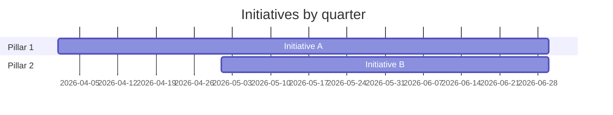

# 🧭 {{team_name}} Product Strategy {color="purple"}

<callout icon="🧭" color="purple_bg">
	**Strategy hub.** Vision, mission, pillars, OKRs, initiatives, and the decision log. Update quarterly — significant decisions become ADRs in <mention-page url="">Documents</mention-page>.
</callout>

<table_of_contents color="gray"/>

<columns>
	<column>
		### 🌅 Vision {color="purple"}
		> _One sentence: desired end state._
	</column>
	<column>
		### 🎯 Mission {color="blue"}
		> _What we do, for whom, why it matters._
	</column>
</columns>

## Strategic pillars

<columns>
	<column>
		### Pillar 1 {color="purple"}
		_Short description — what this pillar produces._
	</column>
	<column>
		### Pillar 2 {color="blue"}
		_Short description._
	</column>
	<column>
		### Pillar 3 {color="green"}
		_Short description._
	</column>
</columns>

## OKRs — current quarter

<table fit-page-width="true" header-row="true">
	<tr color="purple_bg">
		<td>Objective</td><td>Key result</td><td>Status</td><td>Owner</td>
	</tr>
	<tr>
		<td>**O1**</td><td>_KR1_</td><td>🟡</td><td>{{primary_member_id}}</td>
	</tr>
	<tr>
		<td>**O2**</td><td>_KR2_</td><td>🟢</td><td>—</td>
	</tr>
</table>

## Initiatives

<callout icon="🚀" color="purple_bg">
	**Active initiatives map to Tasks DB rows with `Type = Initiative`.** Use the Tasks DB filter to see live state.
</callout>

- [ ] _Initiative 1_ — link to Tasks row
- [ ] _Initiative 2_ — link to Tasks row

## Roadmap

_Replace with your real roadmap. Notion renders mermaid Gantts inline._

## Decision log

<callout icon="📜" color="purple_bg">
	**Significant strategic decisions.** Heavy ones get an ADR (<mention-page url="">Documents</mention-page> → `Type = ADR`).
</callout>

Recent decisions (last 5)

- _YYYY-MM-DD — Decision — owner — rationale (link to ADR)_

## Cadences

| Cadence | Output |
|---|---|
| **Quarterly** | OKRs review, pillar refresh, roadmap update |
| **Monthly** | Initiative health check, scope adjust |
| **Per sprint** | Initiative-level Tasks DB grooming |

---

_Wired by `jstack-notion-setup` — `notion_defaults.parent_pages.product_strategy` (catalog: `product_strategy`)_
