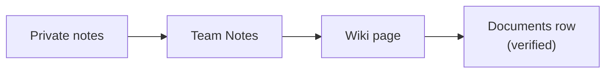

# 📚 {{team_name}} Wiki {color="blue"}

<callout icon="📚" color="blue_bg">
	**Single source of truth.** Pair with <mention-page url="">Documents</mention-page> for the file catalog and <mention-page url="">Engineering</mention-page> for operational state.
</callout>

<table_of_contents color="gray"/>

## Sections

<columns>
	<column>
		### 🏛️ Foundations {color="blue"}
		- Overview
		- Architecture
		- Glossary
	</column>
	<column>
		### 🚀 Working here {color="green"}
		- Onboarding
		- Conventions
		- FAQs
	</column>
	<column>
		### 🛠️ Operational {color="purple"}
		- Runbooks
		- Incident playbook
		- Rollback procedures
	</column>
</columns>

## Conventions

<callout icon="💡" color="yellow_bg">
	**Each top-level section is a child page.** H2 for sections, code blocks for snippets, callouts for warnings. Mark verified pages with Notion's `verified` status.
</callout>

| Page type | When to use |
|---|---|
| **Wiki child page** | Evergreen narrative (what / how / why) |
| **Documents row** | Specific artifacts (this ADR, this runbook) |
| **Tasks row** | Active work (initiative, ticket) |
| **Notes** | Drafts before promotion |

## Promotion path

## Ownership

<callout icon="👥" color="green_bg">
	**Each Wiki section has a named owner.** Owners are responsible for verifying their pages quarterly.
</callout>

| Section | Owner | Last reviewed |
|---|---|---|
| Overview | {{primary_member_id}} | _date_ |
| Architecture | _name_ | _date_ |
| Onboarding | _name_ | _date_ |
| Runbooks | _name_ | _date_ |

## Skills that write here

- `/jstack:notion knowledge-base` — wiki / runbook authoring
- `/jstack:knowledge intake` — promote private notes to Wiki
- `/jstack:knowledge process` — clean up + categorize

---

_Wired by `jstack-notion-setup` — `notion_defaults.parent_pages.product_wiki` (catalog: `product_wiki`)_
