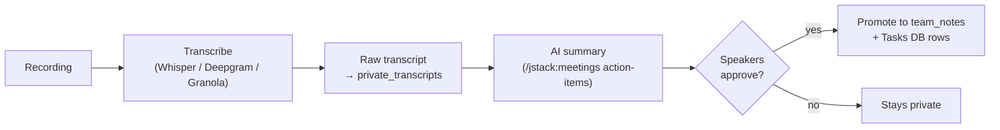

# 🎤 Transcriptions — {{team_name}} {color="purple"}

<callout icon="🎤" color="purple_bg">
	**Transcripts hub.** Index of recordings + AI-generated summaries. Raw transcripts default to `parent_pages.private_transcripts` (manager-only). Public summaries can be promoted to Team Notes.
</callout>

<table_of_contents color="gray"/>

<columns>
	<column>
		### 🆕 Latest {color="purple"}
		_Most recent 5 transcript pages. Replace with `<mention-page>` blocks._
	</column>
	<column>
		### 🛠️ Capture tools {color="blue"}
		- **Granola** — daily auto-capture
		- **Whisper** — local, RAM-safe
		- **Deepgram** — diarized, cloud
		- **ElevenLabs STT** — fast, cloud
	</column>
</columns>

## Privacy + routing

<callout icon="🔒" color="red_bg">
	**Default: private.** Raw transcripts go to `parent_pages.private_transcripts`. Only **AI-generated summaries** that the speakers approve get promoted to Team Notes or other team-visible surfaces. Org policy may further restrict.
</callout>

| Artifact | Default home | Override |
|---|---|---|
| Raw transcript | `private_transcripts` | manual move |
| AI summary | `private_transcripts` | promote to `team_notes` if approved |
| Action items | `Tasks` DB row | extracted by skill |

## Workflow

## Recent transcripts

Recent transcript pages (last 10)

_Replace with `<mention-page>` blocks once transcripts exist._

- _YYYY-MM-DD — Meeting title (Granola)_
- _YYYY-MM-DD — Meeting title (Deepgram)_
- ...

## Compliance notes

<callout icon="⚠️" color="yellow_bg">
	Some jurisdictions require explicit consent before recording. Tag affected meetings + verify org policy. PII / customer data should not be embedded in transcripts that auto-sync to AI services.
</callout>

## Skills that write here

- `/jstack:meetings transcribe` — full capture flow
- `/jstack:granola-daily-summary` — Granola digest
- `whisper-transcribe` / `deepgram-stt` / `elevenlabs-stt` — capture
- `gusto-one-on-one-transcript` — overlay (PE-privacy defaults)

---

_Wired by `jstack-notion-setup` — `notion_defaults.parent_pages.transcriptions_dashboard` (catalog: `transcriptions_dashboard`)_
